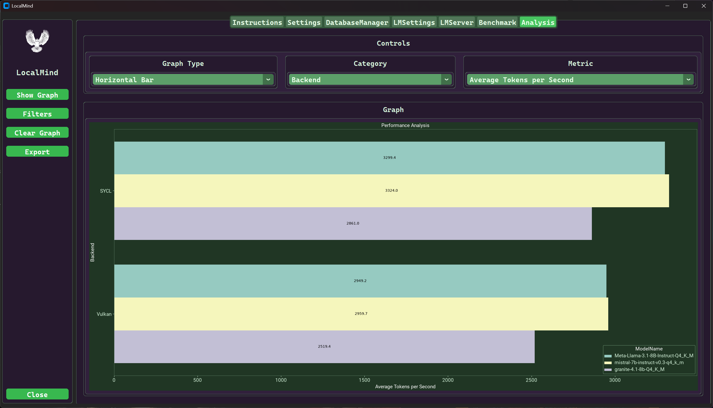

# LocalMind — AI Workbench

*LocalMind* is a Python application based on customtkinter used to deploy LLM models on local hardware using llama.cpp. *LocalMind* provides a GUI front end for llama.cpp to run, benchmark, and compare model performance and characteristics.

See the [Local Mind Documentation for details](./docs/localmind.md)

