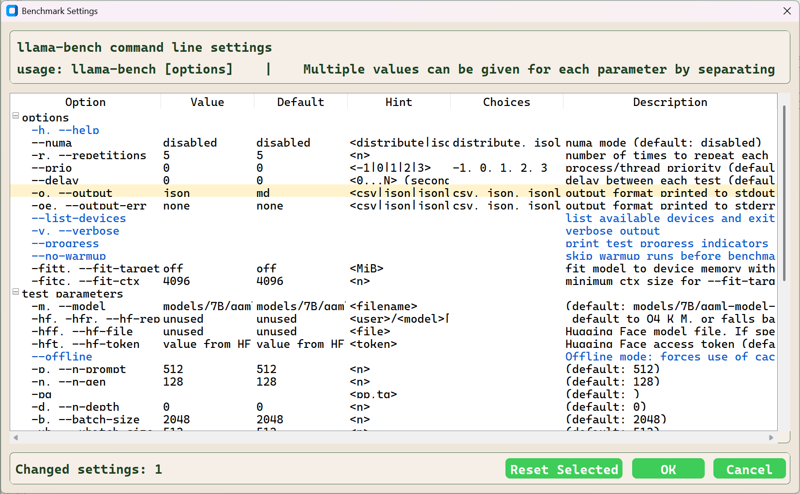
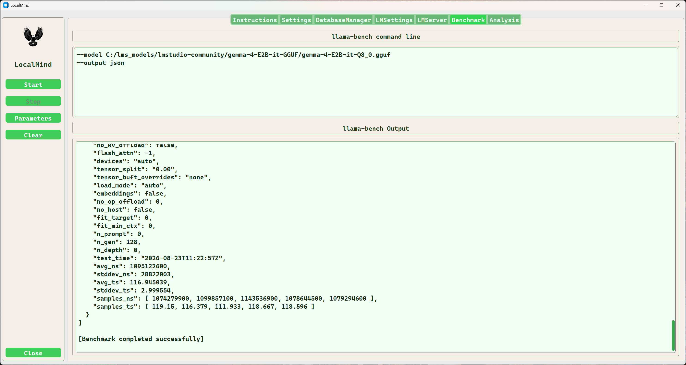

# Benchmark Tab
The Benchmark tab is used to benchmark models and backends using the llama-bench command. By default the model and the benchmark setting `--output json` are the only selected options. You should select a valid model because it is likely that the default model is unavailable. Any benchmark setting may be changed and used with the selected model. The LlamaBenchSettingsDialog dialog is shared between the server and the benchmark tabs. 
The backend that is selected in LMSettings Executable Path is used to launch llama-bench. This setting can only be changed in the LMSetting tab.

**Sidebar Buttons**

| Name | Description |
| :--- | :---------- |
| Start | Starts a benchmarl process using the selected model and command line arguments |
| Stop | Ends the current benchmark in progress |
| Parameters | Click this button to open the benchmark settings dialog.<br>This is where the model is selected and any additional command line arguments to be used for the benchmark|
| Clear | Click this button to clear the llama-bench Output console. |

** The Benchmark Settings Dialog **

* [Settings Dialog details](./settings-dialog.md)

- Settings changed from default are highlighted and appended to the list of changed options returned for the benchmark run.
- JSON output is required, this option must not change.



## Overview

The benchmark application illama-bench producses two test records for each benchmark, one for prompt and one for generation. The tokens per second for these two test vary significantly.

### Example llama-bench output

```JSON
[
  {
    "build_commit": "bebc9350e",
    "build_number": 10700,
    "cpu_info": "AMD Ryzen 9 7900X3D 12-Core Processor          ",
    "gpu_info": "Intel(R) Arc(TM) Pro B70 Graphics",
    "backends": "SYCL",
    "model_filename": "C:/lms_models/lmstudio-community/Qwen3.6-35B-A3B-GGUF/Qwen3.6-35B-A3B-Q4_K_M.gguf",
    "model_type": "qwen35moe 35B.A3B Q4_K - Medium",
    "model_size": 21155768832,
    "model_n_params": 34660610688,
    "n_batch": 2048,
    "n_ubatch": 512,
    "n_threads": 12,
    "cpu_mask": "0x0",
    "cpu_strict": f
	alse,
    "poll": 50,
    "type_k": "f16",
    "type_v": "f16",
    "n_gpu_layers": -1,
    "n_cpu_moe": 0,
    "split_mode": "layer",
    "main_gpu": 0,
    "no_kv_offload": false,
    "flash_attn": -1,
    "devices": "auto",
    "tensor_split": "0.00",
    "tensor_buft_overrides": "none",
    "load_mode": "auto",
    "lazy_mode": "auto",
    "embeddings": false,
    "no_op_offload": 0,
    "no_host": false,
    "fit_target": 0,
    "fit_min_ctx": 0,
    "n_prompt": 512,
    "n_gen": 0,
    "n_depth": 0,
    "test_time": "2026-08-30T10:19:31Z",
    "avg_ns": 383818280,
    "stddev_ns": 4376385,
    "avg_ts": 1334.103112,
    "stddev_ts": 15.184918,
    "samples_ns": [ 381289600, 389764200, 378470200, 383301000, 386266400 ],
    "samples_ts": [ 1342.81, 1313.61, 1352.81, 1335.76, 1325.51 ]
  },
  {
    "build_commit": "bebc9350e",
    "build_number": 10700,
    "cpu_info": "AMD Ryzen 9 7900X3D 12-Core Processor          ",
    "gpu_info": "Intel(R) Arc(TM) Pro B70 Graphics",
    "backends": "SYCL",
    "model_filename": "C:/lms_models/lmstudio-community/Qwen3.6-35B-A3B-GGUF/Qwen3.6-35B-A3B-Q4_K_M.gguf",
    "model_type": "qwen35moe 35B.A3B Q4_K - Medium",
    "model_size": 21155768832,
    "model_n_params": 34660610688,
    "n_batch": 2048,
    "n_ubatch": 512,
    "n_threads": 12,
    "cpu_mask": "0x0",
    "cpu_strict": false,
    "poll": 50,
    "type_k": "f16",
    "type_v": "f16",
    "n_gpu_layers": -1,
    "n_cpu_moe": 0,
    "split_mode": "layer",
    "main_gpu": 0,
    "no_kv_offload": false,
    "flash_attn": -1,
    "devices": "auto",
    "tensor_split": "0.00",
    "tensor_buft_overrides": "none",
    "load_mode": "auto",
    "lazy_mode": "auto",
    "embeddings": false,
    "no_op_offload": 0,
    "no_host": false,
    "fit_target": 0,
    "fit_min_ctx": 0,
    "n_prompt": 0,
    "n_gen": 128,
    "n_depth": 0,
    "test_time": "2026-08-30T10:19:38Z",
    "avg_ns": 1265439260,
    "stddev_ns": 5279869,
    "avg_ts": 101.152055,
    "stddev_ts": 0.421949,
    "samples_ns": [ 1266848900, 1272655200, 1262384800, 1266691200, 1258616200 ],
    "samples_ts": [ 101.038, 100.577, 101.395, 101.051, 101.699 ]
  }
]

```

## Database implementation

Either MS SQL Server or SQLite3 are used to archive benchmark results. The database is selected using the DatabaseManager tab. When changing from MS SQL Server to SQLite3 or SQLite3 to MS SQL Server you *must* restart the application to reflect the change. 

The following python code is used to initialize the selected database.

### Database Schema Creation

```python
    def init_tables(self) -> None:
        if self.use_sqlsvr:
            db = pyOdbcExt(conn_string=self.get_connection_string("LocalMind"), logger=self.logger)
            db.execute_sql(sql="""
                IF OBJECT_ID(N'dbo.Models', N'U') IS NULL
                BEGIN
                    CREATE TABLE dbo.Models
                    (
                        ModelId              INT IDENTITY(1,1) PRIMARY KEY,

                        -- Human/display fields
                        ModelName            NVARCHAR(255) NOT NULL,
                        ModelFileName        NVARCHAR(255) NOT NULL,
                        ModelType            NVARCHAR(100) NULL,
                        ModelFamily          NVARCHAR(100) NULL,
                        Quantization         NVARCHAR(50) NULL,

                        -- Path/location fields
                        ModelPath            NVARCHAR(1000) NOT NULL,
                        ModelPathHash        CHAR(64) NOT NULL,

                        -- Stable cross-platform model identity
                        ModelIdentityHash    CHAR(64) NOT NULL,

                        -- Model size/detail fields
                        ModelSizeBytes       BIGINT NULL,
                        ModelParameterCount  BIGINT NULL,
                        ModelSha256          CHAR(64) NULL,

                        -- User/application fields
                        Notes                NVARCHAR(MAX) NULL,
                        CreatedAt            DATETIME2 NOT NULL DEFAULT SYSUTCDATETIME(),

                        CONSTRAINT UQ_Models_ModelIdentityHash UNIQUE (ModelIdentityHash)
                    );                
                END;
                """
            )
            
            db.execute_sql(sql="""
                IF OBJECT_ID(N'dbo.BenchmarkRuns', N'U') is NULL
                BEGIN
                    CREATE TABLE dbo.BenchmarkRuns
                    (
                        BenchmarkRunId     INT IDENTITY(1,1) PRIMARY KEY,
                        ModelId            INT NOT NULL,
                        RunStartedAt       DATETIME2 NOT NULL DEFAULT SYSUTCDATETIME(),
                        RunFinishedAt      DATETIME2 NULL,
                        CommandLine        NVARCHAR(MAX) NULL,
                        LlamaBenchVersion  NVARCHAR(100) NULL,
                        Backend            NVARCHAR(100) NULL,
                        HostName           NVARCHAR(255) NULL,
                        CpuInfo            NVARCHAR(255) NULL,
                        GpuInfo            NVARCHAR(255) NULL,
                        Success            BIT NOT NULL DEFAULT 0,
                        ExitCode           INT NULL,
                        RawJson            NVARCHAR(MAX) NULL,
                        RawOutput          NVARCHAR(MAX) NULL,
                        ErrorOutput        NVARCHAR(MAX) NULL,
                        Notes              NVARCHAR(MAX) NULL,

                        CONSTRAINT FK_BenchmarkRuns_Models
                            FOREIGN KEY (ModelId) REFERENCES dbo.Models(ModelId)
                    );                           
                END; """
                        )
            db.execute_sql(sql="""
                IF OBJECT_ID(N'dbo.BenchmarkSettings', N'U') is NULL
                BEGIN
                    CREATE TABLE dbo.BenchmarkSettings
                    (
                        BenchmarkSettingId INT IDENTITY(1,1) PRIMARY KEY,
                        BenchmarkRunId     INT NOT NULL,
                        SettingName        NVARCHAR(100) NOT NULL,
                        SettingValue       NVARCHAR(500) NULL,

                        CONSTRAINT FK_BenchmarkSettings_BenchmarkRuns
                            FOREIGN KEY (BenchmarkRunId) REFERENCES dbo.BenchmarkRuns(BenchmarkRunId)
                            ON DELETE CASCADE,

                        CONSTRAINT UQ_BenchmarkSettings_RunName
                            UNIQUE (BenchmarkRunId, SettingName)
                    );
                END; """)
            
            db.execute_sql(sql="""
                IF OBJECT_ID(N'dbo.BenchmarkResults', N'U') is NULL
                BEGIN
                    CREATE TABLE dbo.BenchmarkResults
                    (
                        BenchmarkResultId      INT IDENTITY(1,1) PRIMARY KEY,
                        BenchmarkRunId         INT NOT NULL,

                        TestType               NVARCHAR(50) NULL,
                        TestTime               DATETIME2 NULL,
                        NPrompt                INT NULL,
                        NGen                   INT NULL,
                        NDepth                 INT NULL,
                        AvgNs                  BIGINT NULL,
                        StddevNs               BIGINT NULL,


                        AvgTokensPerSecond     FLOAT NULL,
                        StddevTokensPerSecond  FLOAT NULL,

                        SamplesNsJson          NVARCHAR(MAX) NULL,
                        SamplesTokensPerSecondJson          NVARCHAR(MAX) NULL,
                        RawJson                NVARCHAR(MAX) NULL,
                        CreatedAt              DATETIME2 NOT NULL DEFAULT SYSUTCDATETIME(),

                        CONSTRAINT FK_BenchmarkResults_BenchmarkRuns
                            FOREIGN KEY (BenchmarkRunId)
                            REFERENCES dbo.BenchmarkRuns(BenchmarkRunId)
                            ON DELETE CASCADE
                    );                           
                END; """                
                )
            
            db.execute_sql(sql="""
                IF OBJECT_ID(N'dbo.Hosts', N'U') IS NULL
                BEGIN
                    CREATE TABLE dbo.Hosts
                    (
                        HostId        INT IDENTITY(1,1) PRIMARY KEY,
                        HostName      NVARCHAR(255) NOT NULL,
                        OsName        NVARCHAR(100) NULL,
                        OsVersion     NVARCHAR(255) NULL,
                        CpuInfo       NVARCHAR(1000) NULL,
                        RamBytes      BIGINT NULL,
                        Notes         NVARCHAR(MAX) NULL,
                        CreatedAt     DATETIME2 NOT NULL DEFAULT SYSUTCDATETIME(),

                        CONSTRAINT UQ_Hosts_HostName UNIQUE (HostName)
                    );
                END;"""
               )
            

        else:
            if self._database is None:
                raise ValueError("SQLite database filename must be provided when use_sqlsvr is False.")
            else:
                if self.logger is not None:
                    self.logger.info(f"Initializing SQLite database at {self._database}")
            conn = SqliteExt(self._database, logger=self.logger)
            try:
                conn.execute_sql(sql="PRAGMA foreign_keys = ON;")

                conn.execute_sql(sql="""
                    CREATE TABLE IF NOT EXISTS Models
                    (
                        ModelId              INTEGER PRIMARY KEY AUTOINCREMENT,

                        -- Human/display fields
                        ModelName            TEXT NOT NULL,
                        ModelFileName        TEXT NOT NULL,
                        ModelType            TEXT NULL,
                        ModelFamily          TEXT NULL,
                        Quantization         TEXT NULL,

                        -- Path/location fields
                        ModelPath            TEXT NOT NULL,
                        ModelPathHash        TEXT NOT NULL,

                        -- Stable cross-platform model identity
                        ModelIdentityHash    TEXT NOT NULL,

                        -- Model size/detail fields
                        ModelSizeBytes       INTEGER NULL,
                        ModelParameterCount  INTEGER NULL,
                        ModelSha256          TEXT NULL,

                        -- User/application fields
                        Notes                TEXT NULL,
                        CreatedAt            TEXT NOT NULL DEFAULT CURRENT_TIMESTAMP,

                        CONSTRAINT UQ_Models_ModelIdentityHash UNIQUE (ModelIdentityHash)
                    );                
                """)

                conn.execute_sql(sql="""
                    CREATE TABLE IF NOT EXISTS BenchmarkRuns
                    (
                        BenchmarkRunId     INTEGER PRIMARY KEY AUTOINCREMENT,
                        ModelId            INTEGER NOT NULL,
                        RunStartedAt       TEXT NOT NULL DEFAULT CURRENT_TIMESTAMP,
                        RunFinishedAt      TEXT NULL,
                        CommandLine        TEXT NULL,
                        LlamaBenchVersion  TEXT NULL,
                        Backend            TEXT NULL,
                        HostName           TEXT NULL,
                        CpuInfo            TEXT NULL,
                        GpuInfo            TEXT NULL,
                        Success            INTEGER NOT NULL DEFAULT 0,
                        ExitCode           INTEGER NULL,
                        RawJson            TEXT NULL,
                        RawOutput          TEXT NULL,
                        ErrorOutput        TEXT NULL,
                        Notes              TEXT NULL,

                        CONSTRAINT FK_BenchmarkRuns_Models
                            FOREIGN KEY (ModelId)
                            REFERENCES Models(ModelId)
                    );
                """)

                conn.execute_sql(sql="""
                    CREATE TABLE IF NOT EXISTS BenchmarkSettings
                    (
                        BenchmarkSettingId INTEGER PRIMARY KEY AUTOINCREMENT,
                        BenchmarkRunId     INTEGER NOT NULL,
                        SettingName        TEXT NOT NULL,
                        SettingValue       TEXT NULL,

                        CONSTRAINT FK_BenchmarkSettings_BenchmarkRuns
                            FOREIGN KEY (BenchmarkRunId)
                            REFERENCES BenchmarkRuns(BenchmarkRunId)
                            ON DELETE CASCADE,

                        CONSTRAINT UQ_BenchmarkSettings_RunName
                            UNIQUE (BenchmarkRunId, SettingName)
                    );
                """)

                conn.execute_sql("""
                    CREATE TABLE IF NOT EXISTS BenchmarkResults
                    (
                        BenchmarkResultId      INTEGER PRIMARY KEY AUTOINCREMENT,
                        BenchmarkRunId         INTEGER NOT NULL,

                        TestType               TEXT NULL,
                        TestTime               TEXT NULL,
                        NPrompt                INTEGER NULL,
                        NGen                   INTEGER NULL,
                        NDepth                 INTEGER NULL,
                        AvgNs                  INTEGER NULL,
                        StddevNs               INTEGER NULL,
                        AvgTokensPerSecond     REAL NULL,
                        StddevTokensPerSecond  REAL NULL,
                        SamplesNsJson          TEXT NULL,
                        SamplesTokensPerSecondJson          TEXT NULL,
                        RawJson                TEXT NULL,
                        CreatedAt              TEXT NOT NULL DEFAULT CURRENT_TIMESTAMP,


                        CONSTRAINT FK_BenchmarkResults_BenchmarkRuns
                            FOREIGN KEY (BenchmarkRunId)
                            REFERENCES BenchmarkRuns(BenchmarkRunId)
                            ON DELETE CASCADE
                    );
                """)
                conn.execute_sql("""
                    CREATE TABLE IF NOT EXISTS Hosts
                    (
                        HostId        INTEGER PRIMARY KEY AUTOINCREMENT,
                        HostName      TEXT NOT NULL,
                        OsName        TEXT NULL,
                        OsVersion     TEXT NULL,
                        CpuInfo       TEXT NULL,
                        RamBytes      INTEGER NULL,
                        Notes         TEXT NULL,
                        CreatedAt     TEXT NOT NULL DEFAULT CURRENT_TIMESTAMP,

                        CONSTRAINT UQ_Hosts_HostName UNIQUE (HostName)
                    );                
                """)    

            except sqlite3.Error as exc:
                #conn.rollback()
                if self.logger is not None:
                    self.logger.exception(f"Error creating SQLite benchmark tables: {exc}")

            finally:
                pass

```


## Benchmark Tab Screen




