# DatabaseManager

***

# Overview

The database manager tab is used to manage database schemas. It does not provide a means to query data.

**Note:**

Operations allowed on an MS SQL Server depend on the permissions of the user. 

## MS SQLServer Access

Access to an MS SQL Server is controlled through system environment variables as shown here.
Access is controlled using ODBC connection strings derived from these environment variables no DSN is used.

```python
self.server = os.environ.get('SQL_SERVER', "127.0.0.1")
self.port = int(os.environ.get('SQL_PORT', 1433))
self.user = os.environ.get('SQL_SVR_USER', "user")
self.password = os.environ.get('SQL_SVR_PASSWORD', "password")
self.driver = os.environ.get('SQL_SVR_DRIVER', "ODBC Driver 18 for SQL Server")
```

***

### The primary user interface is three tkinter ListBox windows;

* Databases
* Tables
* Content

### Description of widgets used on the DatabaseManager tab.

| Item | Values | Description |
| :--- | :----- |:----------- |
| Database Type | SQLite3<br>MS SQL Server | Click to select the type of database. The Databases lists is populated when a selection is made. |
| Databases | for SQLite3 a single database.<br>A list of databases contained in the SQL Server. | List is populated upon selection of a database type |
| Tables | A list of tables contained in the selected database. | List is populated upon selection of a database |
| Content | A list of columns and column types contained in the selected table. | List is populated upon selection of a table |
| | | | |
| New | Clicked | Use to either create a new database or a new table. |
| Add | Clicked | Use to add new content to the selected table n the selected database. |
| Remove | Clicked | Use to remove the selected database, table, or column. |

### The DataBase Manager Tab.

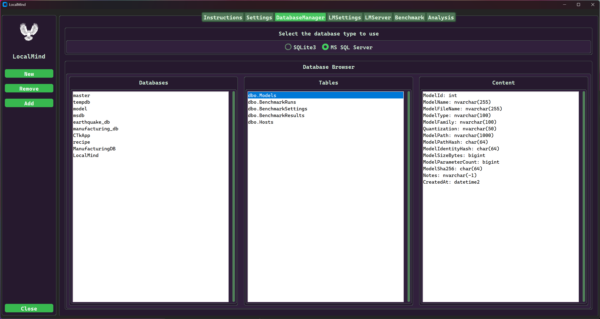

## Examples

### Create a new SQLite3 database

* Click the 'New' button

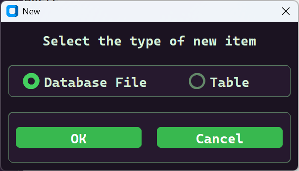

* Select 'Database File' and then browse to the location and specify the new database filename.Follow the directions presented in the dialog.

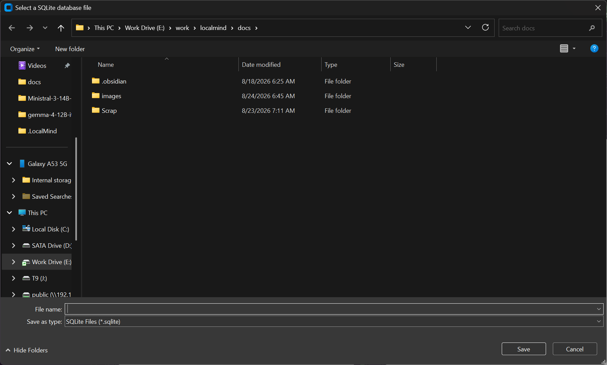

### Create a new table in the selected database

**When a new table is created it is created with the column named id as the primary key.**

* Click the *New* sidebar button

* Click the *Table* radio button and Ok

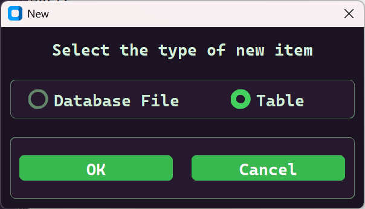

* Then type the name of the Table you wish to create

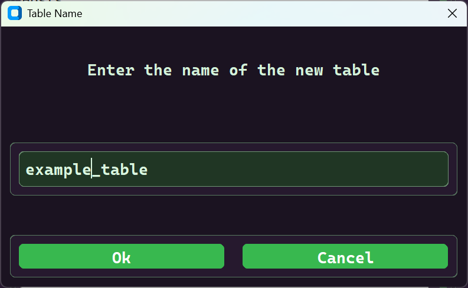

### Add columns to the selected database and table

* Select the table you want to add a column

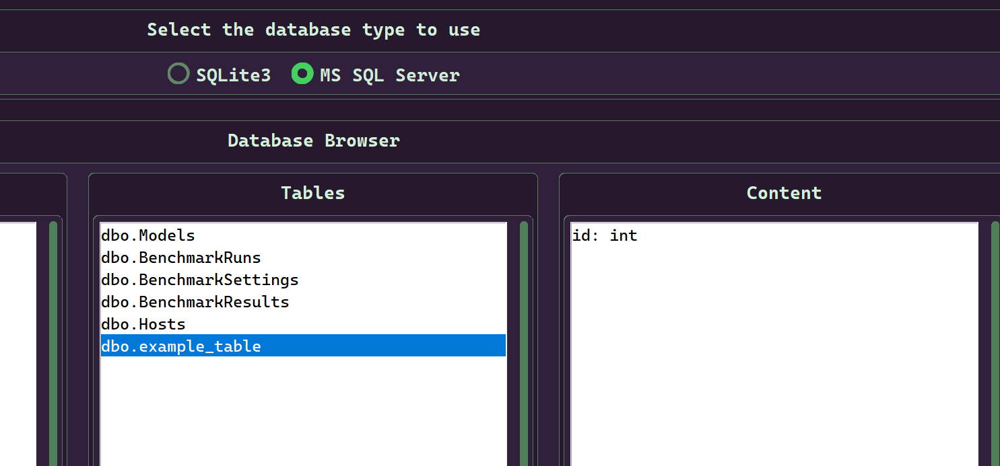

* Click the Add button and enter the new column name it's type.

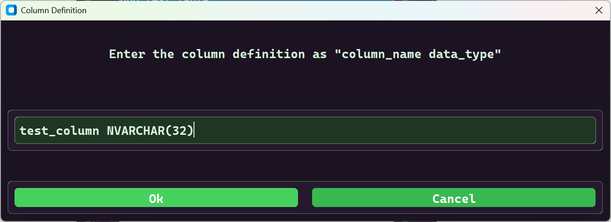

* If the new columm does not appear click the table again to see it in the content list.

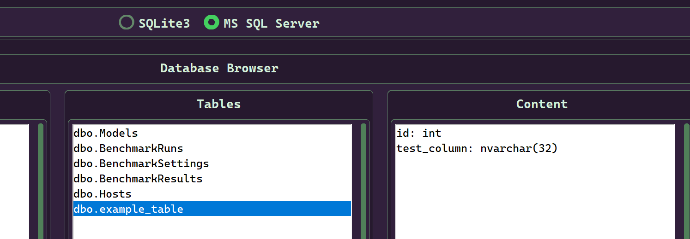

### Remove a column from a database table.

You cannot remove a column from an SQLite3 database. This feature only works with MS SQL Server.

* Select the column you want to remove and click the *Remove* button on the sidebar.

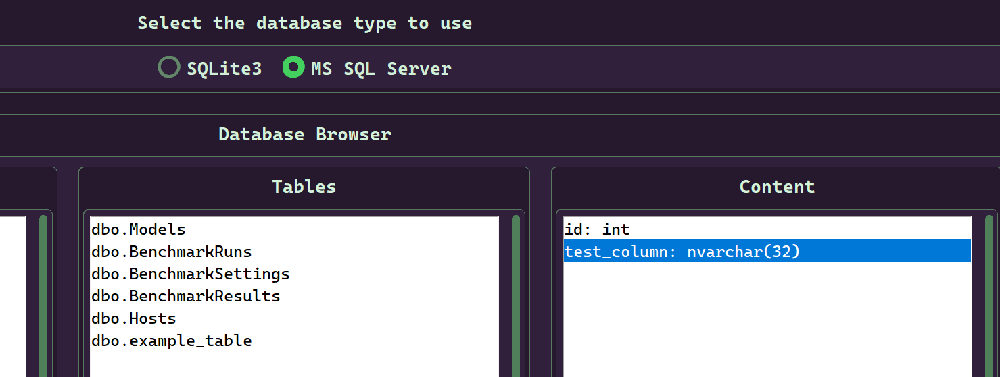

* Confirm the column to be removed.

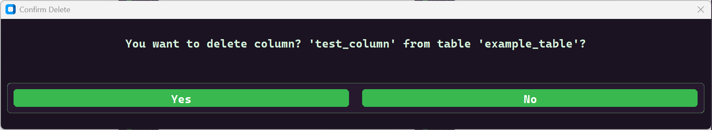

### Delete a database

Select the database you want to remove and click the remove button. Then confirm the action to remove the database file.

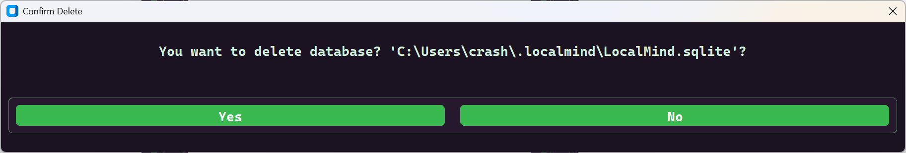


