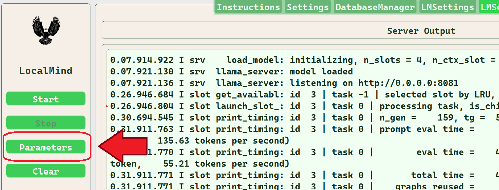
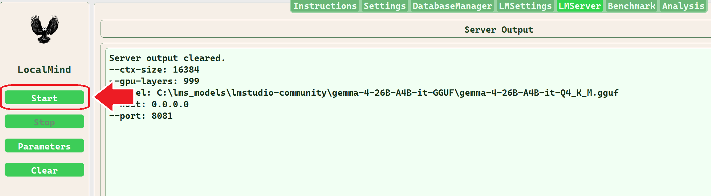
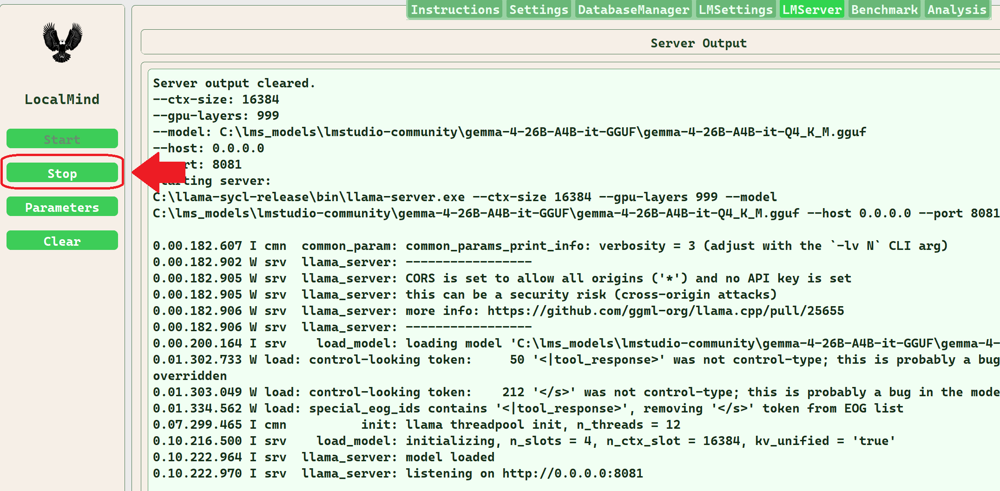
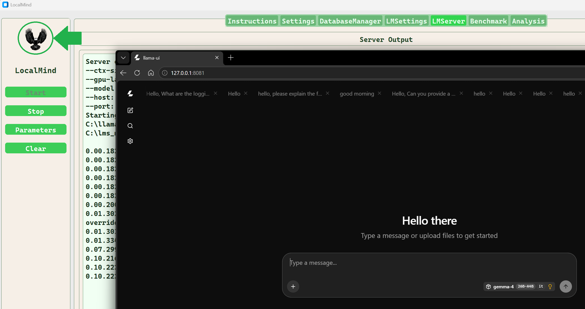
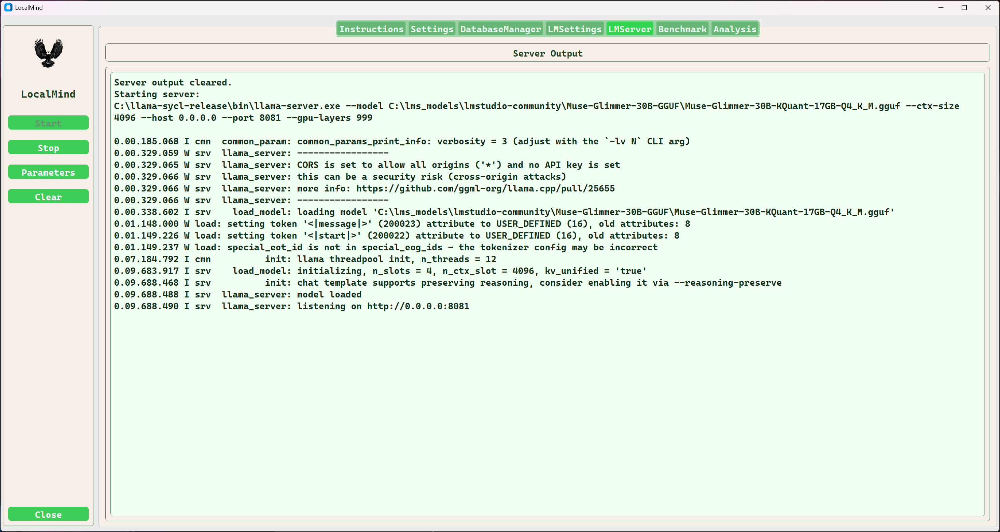

# LMServer Tab

The LMServer tab is used to run LLM models on local hardware. By default the model and settings selected in the LMSettings tab are used to run the model. Any setting may be changed and used with the selected model, even the selected nodel can be changed using the server settings dialog. The LlamaBenchSettingsDialog dialog is shared between the server and the benchmark tabs. 

The backend that is selected in LMSettings Executable Path is used to run the server. 
**This setting can only be changed in the LMSettings tab.**

**Sidebar Buttons**
| Name | Description |
| :--- | :---------- |
| Start | Starts a server process using the selected model and command line arguments |
| Stop | Ends the current server process in progress |
| Parameters | Click this button to open the server settings dialog.|
| Clear | Click this button to clear the llama-bench Output console. |

The command line option configuration data is contained in a dictionary named HELP_SPEC and it is generated for server and for benchmark.

If you need to make changes to the option descriptions they can be found in gui/llama_server_help_spec.py

## Change server settings

Clicking the Parameters button activates the Server Settings Dialog.

### Open the server settings dialog

### The Server Settings Dialog Features.

* [Settings Dialog details](./settings-dialog.md)

## Running the server

Start and Stop the server using the respective sidebar buttons.

### Starting and Stopping the llama-server

## Launching llama-ui in the default browser

Clicking the localmind logo in the sidebar will launch llama-ui in the default browser.

## The LMServer Tab

