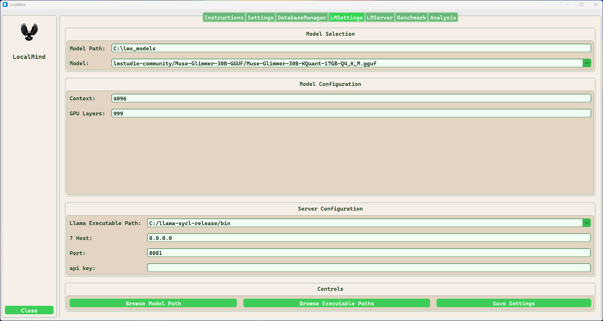
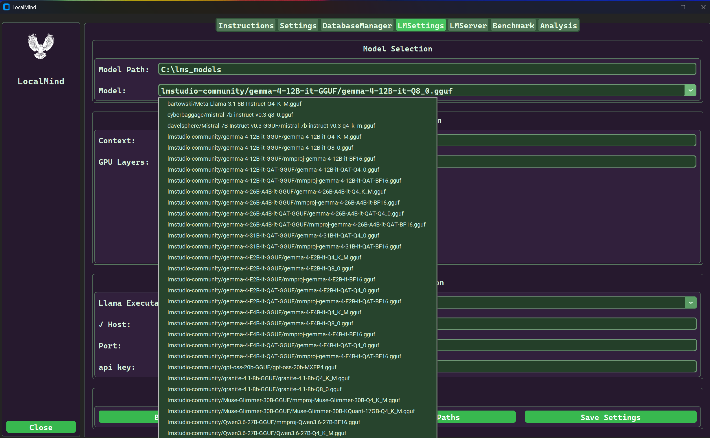
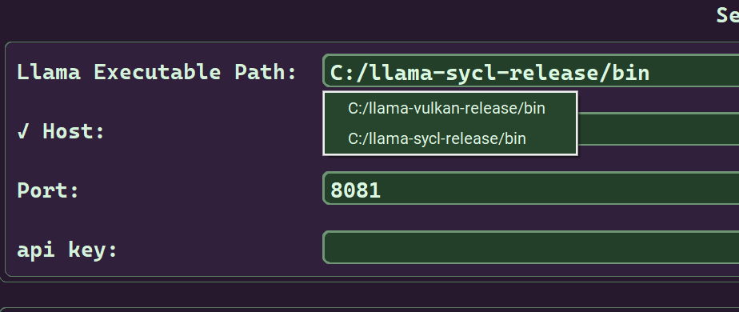

# LMSettings

LMSettings provides persistent common settings for llama-server.These settings are a few of the more common settings you will want to use with each invocation of llama-server.

All llama-server command line arguments can be configured using the Parameters button in the LMServer tab before launching. 

***

### LMSettings Tab

***

### Description of widgets used on the LMSettings tab

| Item | Values | Description |
| :--- | :----- |:----------- |
| Model Path | The path to your models | You can directly type in the model path or click the 'Browse Model Path' button to select the folder where your models are located |
| Model | The selected model | All the gguf files stored in the models folder are displayed in the drop list. |
| Context | The prompt context size | The maximim is specified for each model that can be found on huggingface The amount of VRAM available to the model is the primary constraint. |
| GPU Layers | | Max number of layers to store in VRAM either an exact number, auto, or All |
| Llama Executable Path | Path to llama-server location | Use the 'Browse Executable Paths' button to populate the drop-list Multple instalations of llama.cpp are supported |
| Host | Any valid IP Address | The Value entered is checked when a value is entered. |
| Port | A valid service port | The default is 8081, different from llama-server default |
| api key | N/U | This value is not used for local models, leave it blank. |
| Browse Model Path | Clicked | Select the folder that holds your models | This folder is recursively searched for all .gguf files }
| Browse Executable Paths | A path llama.cpp installation folder | Once selected this path is added to the Llama Executable Path combo box |

### Settings Examples

#### Model selection combo dropdown

#### LLama Executable Path combo dropdown

