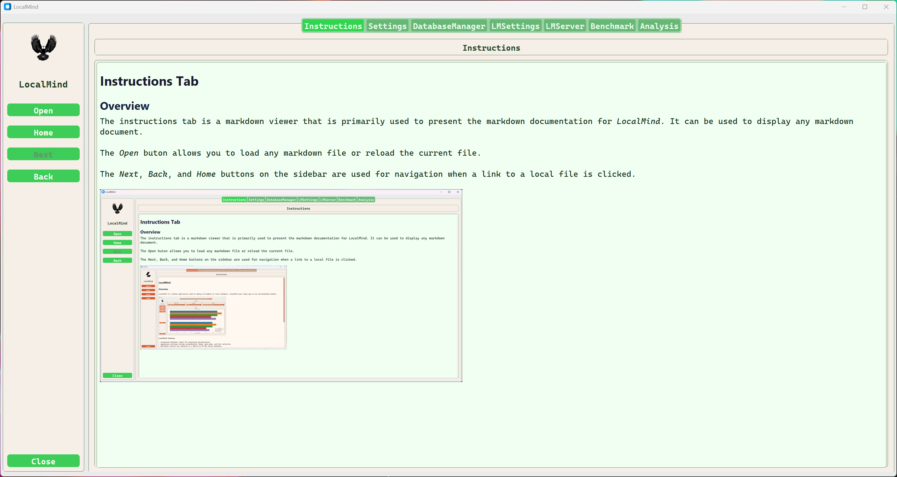

# Instructions Tab

## Overview

TThe Instructions Tab serves as a dedicated markdown viewer, primarily designed to display LocalMind documentation. However, it is capable of rendering any standard markdown file.

## Key Controls

- Open: Load a new markdown file or refresh the current view.
- Navigation: Use the Next, Back, and Home buttons on the sidebar to navigate through local file links.

