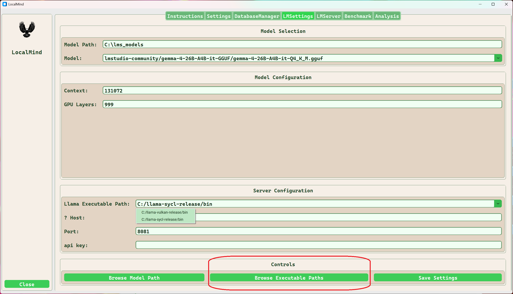

# Building llama.cpp for LocalMind

LocalMind can use llama.cpp builds with CPU, SYCL, or Vulkan backends.

The systems used during LocalMind development include:

| Platform | GPU | Backends |
| :--- | :--- | :--- |
| Windows | Intel Arc Pro B70 | SYCL, Vulkan |
| Fedora Linux | Intel Arc B580 | SYCL, Vulkan |

The examples in this document show how to clone, build, install, and configure llama.cpp for use with LocalMind. The supplied scripts are examples: paths, compiler versions, package names, and Linux prerequisites may need to be adapted for your system.

## Recommended locations

Keep the build scripts in a directory on your `PATH` so they are easy to run.

**Linux**

```text
/home/<user>/.local/bin
```

or:

```text
/home/<user>/bin
```

**Windows**

```text
C:\Users\<user>\bin
```

---

## Common requirements

### Software

- [llama.cpp](https://github.com/ggml-org/llama.cpp)
- [Git](https://git-scm.com/)
- [CMake](https://cmake.org/download/)
- [Visual Studio Community](https://visualstudio.microsoft.com/vs/community/) for the Windows MSVC build
- [Intel oneAPI Toolkit](https://www.intel.com/content/www/us/en/developer/tools/oneapi/oneapi-toolkit-download.html) for SYCL builds
- [Vulkan SDK](https://vulkan.lunarg.com/sdk/home) for Vulkan builds

When installing oneAPI, use the default installation settings unless you have a specific reason to change them. LocalMind development systems also include Intel Deep Learning Essentials.

### Hardware

Any CPU, GPU, or XPU supported by llama.cpp can be used. The examples here focus on Intel Arc GPUs.

---

## Clone llama.cpp

Choose a working directory and clone the repository.

### Windows

```cmd
set WORKDIR=E:\work
cd /d %WORKDIR%
git clone https://github.com/ggml-org/llama.cpp.git
```

### Linux

```bash
mkdir -p ~/work
cd ~/work
git clone https://github.com/ggml-org/llama.cpp.git
```

---

# Windows builds

The Windows examples use llama.cpp CMake presets.

To see the presets available in your current checkout:

```cmd
cmake --list-presets
```

The LocalMind development builds use:

- `x64-windows-vulkan-release`
- `x64-windows-sycl-release`

The scripts below update the local llama.cpp checkout, configure the requested backend, build it, and install the result into a stable location that LocalMind can reference.

## Common script variables

| Variable | Description |
| :--- | :--- |
| `REPO_PATH` | Path to the cloned llama.cpp repository |
| `BUILD_DIR` | Build directory within the repository |
| `INSTALL_PREFIX` | Destination for the installed llama.cpp build |
| `ONEAPI_VARS` | Intel oneAPI environment setup script |
| `CMAKE_PRESET` | CMake preset used for the build |

---

## Windows Vulkan build

**Requires:**

- Visual Studio
- Vulkan SDK
- CMake

Example build script:

```batch
@echo off
setlocal EnableExtensions

set "REPO_PATH=E:\work\llama.cpp"
set "BUILD_DIR=build-x64-windows-vulkan-release"
set "INSTALL_PREFIX=C:\llama-vulkan-release"
set "CMAKE_PRESET=x64-windows-vulkan-release"

set "VS_VARS=C:\Program Files\Microsoft Visual Studio\18\Community\VC\Auxiliary\Build\vcvars64.bat"


echo [INFO] Navigating to "%REPO_PATH%"
cd /D "%REPO_PATH%" || goto :error

if not exist "CMakeLists.txt" (
    echo [ERROR] Could not find llama.cpp source at "%REPO_PATH%"
    goto :error
)

if exist "%VS_VARS%" (
    echo [INFO] Initializing Visual Studio MSVC environment...
    call "%VS_VARS%" || goto :error
) else (
    echo [ERROR] Could not find "%VS_VARS%"
    goto :error
)

echo [INFO] Pulling latest changes...
git pull --rebase || goto :error

set "PATH=C:\Program Files\Microsoft Visual Studio\18\Community\Common7\IDE\CommonExtensions\Microsoft\CMake\Ninja;%PATH%"

echo [INFO] Configuring with "%CMAKE_PRESET%" preset...
cmake --preset "%CMAKE_PRESET%" || goto :error

echo [INFO] Building...
cmake --build "%BUILD_DIR%" --config Release -j || goto :error

echo [INFO] Deleting install directory...
if exist "%INSTALL_PREFIX%" (
    rd /s /q "%INSTALL_PREFIX%"
)

echo [INFO] Creating install directory...
if not exist "%INSTALL_PREFIX%" mkdir "%INSTALL_PREFIX%" || goto :error

echo [INFO] Installing to "%INSTALL_PREFIX%"...
cmake --install "%BUILD_DIR%" --prefix "%INSTALL_PREFIX%" --config Release || goto :error

echo.
echo [SUCCESS] Update complete.
echo Installed files should be in:
echo   %INSTALL_PREFIX%
pause
exit /b 0

:error
echo.
echo [FAILED] Build/update failed.
echo Current directory:
cd
echo.
pause
exit /b 1
```

---

## Windows SYCL build

**Requires:**

- Intel oneAPI
- CMake

Example build script:

```batch
@echo off
setlocal EnableExtensions

set "REPO_PATH=E:\work\llama.cpp"
set "BUILD_DIR=build-x64-windows-sycl-release"
set "INSTALL_PREFIX=C:\llama-sycl-release"
set "ONEAPI_VARS=C:\Program Files (x86)\Intel\oneAPI\setvars.bat"
set "CMAKE_PRESET=x64-windows-sycl-release"


echo [INFO] Navigating to "%REPO_PATH%"
cd /D "%REPO_PATH%" || goto :error

if not exist "CMakeLists.txt" (
    echo [ERROR] Could not find llama.cpp source at "%REPO_PATH%"
    goto :error
)

if exist "%ONEAPI_VARS%" (
    echo [INFO] Initializing oneAPI...
    call "%ONEAPI_VARS%" intel64 || goto :error
) else (
    echo [ERROR] Could not find setvars.bat at "%ONEAPI_VARS%"
    goto :error
)

set "PATH=C:\Program Files\nodejs;%PATH%"

echo [INFO] Checking Intel runtime DLL path...
where svml_dispmd.dll >nul 2>&1 || (
    echo [ERROR] svml_dispmd.dll not found in PATH after setvars.
    goto :error
)

echo [INFO] Pulling latest changes...
git pull --rebase || goto :error

echo [INFO] Configuring with "%CMAKE_PRESET%" preset...
cmake --preset "%CMAKE_PRESET%" ^
    -DCMAKE_C_COMPILER=icx ^
    -DCMAKE_CXX_COMPILER=icx || goto :error

echo [INFO] Building...
cmake --build "%BUILD_DIR%" --config Release -j || goto :error

echo [INFO] Creating install directory...
if not exist "%INSTALL_PREFIX%" mkdir "%INSTALL_PREFIX%" || goto :error

echo [INFO] Installing to "%INSTALL_PREFIX%"...
cmake --install "%BUILD_DIR%" --prefix "%INSTALL_PREFIX%" --config Release || goto :error

echo.
echo [SUCCESS] Update complete.
echo Installed files should be in:
echo   %INSTALL_PREFIX%
pause
exit /b 0

:error
echo.
echo [FAILED] Build/update failed.
echo Current directory:
cd
echo.
pause
exit /b 1
```

---

# Linux builds

Linux builds require more attention to distribution-specific prerequisites than Windows builds. Ubuntu and Fedora are the primary Linux families used during LocalMind development and testing.

Install compiler and SDK packages using the distribution package manager where practical. This makes future updates easier to manage through normal system updates.

## Linux SYCL prerequisites

For SYCL builds, install Intel oneAPI using the package manager for your distribution.

After installation, the oneAPI setup script is normally located at:

```text
/opt/intel/oneapi/setvars.sh
```

You can verify the installation with:

```bash
source /opt/intel/oneapi/setvars.sh
icx --version
icpx --version
sycl-ls
```

On systems with an Intel GPU, `sycl-ls` should list a GPU device through Level Zero and/or OpenCL.

## Linux Vulkan prerequisites

For the Vulkan SDK tarball installation, follow LunarG's current instructions:

[Getting Started with the Linux Tarball Vulkan SDK](https://vulkan.lunarg.com/doc/view/latest/linux/getting_started.html)

The SDK setup script should be sourced before configuring a Vulkan build so that `VULKAN_SDK`, `PATH`, `LD_LIBRARY_PATH`, `PKG_CONFIG_PATH`, and `CMAKE_PREFIX_PATH` are configured correctly.

---

## Linux SYCL build

The Linux SYCL example does not use a CMake preset. It explicitly selects Intel's compilers and enables `GGML_SYCL`.

The install library directory differs between common Linux families:

- Debian/Ubuntu: `$HOME/.local/lib`
- Fedora/RHEL: `$HOME/.local/lib64`

Example build script:

```bash
#!/usr/bin/env bash
set -euo pipefail

REPO="$HOME/work/llama.cpp"
INSTALL_PREFIX="$HOME/.local"
BUILD_DIR="build-sycl"

# Determine Linux distribution family and installation library directory.
if [[ ! -r /etc/os-release ]]; then
    echo "ERROR: Unable to determine Linux distribution."
    exit 1
fi

. /etc/os-release

if [[ "$ID" == "debian" || "$ID" == "ubuntu" || "${ID_LIKE:-}" == *debian* ]]; then
    DISTRO_FAMILY="debian"
    LIB_DIR="$INSTALL_PREFIX/lib"
elif [[ "$ID" == "fedora" || "$ID" == "rhel" || "$ID" == "centos" || \
        "${ID_LIKE:-}" == *fedora* || "${ID_LIKE:-}" == *rhel* ]]; then
    DISTRO_FAMILY="redhat"
    LIB_DIR="$INSTALL_PREFIX/lib64"
else
    echo "ERROR: Unsupported distribution: ${PRETTY_NAME:-unknown}"
    exit 1
fi

cd "$REPO"

echo "[1/6] Updating repo..."
git fetch --all --prune
git pull --ff-only

echo "[2/6] Cleaning old build..."
rm -rf "$BUILD_DIR"

echo "[3/6] Loading Intel oneAPI..."
ONEAPI_SETUP="/opt/intel/oneapi/setvars.sh"

if [[ -n "${ONEAPI_ROOT:-}" ]]; then
    echo "oneAPI already initialized: $ONEAPI_ROOT"
elif [[ -f "$ONEAPI_SETUP" ]]; then
    set +u
    source "$ONEAPI_SETUP"
    set -u
else
    echo "ERROR: oneAPI setup script not found:"
    echo "  $ONEAPI_SETUP"
    exit 1
fi

if ! command -v icx >/dev/null 2>&1; then
    echo "ERROR: icx not found after loading oneAPI."
    exit 1
fi

if ! command -v icpx >/dev/null 2>&1; then
    echo "ERROR: icpx not found after loading oneAPI."
    exit 1
fi

echo
echo "SYCL devices:"
sycl-ls || true

echo "[4/6] Configuring CMake..."
cmake -B "$BUILD_DIR" \
    -DCMAKE_BUILD_TYPE=Release \
    -DGGML_SYCL=ON \
    -DCMAKE_C_COMPILER=icx \
    -DCMAKE_CXX_COMPILER=icpx \
    -DCMAKE_INSTALL_PREFIX="$INSTALL_PREFIX"

echo "[5/6] Building..."
cmake --build "$BUILD_DIR" --config Release -j"$(nproc)"

echo "[6/6] Installing..."
cmake --install "$BUILD_DIR"

mkdir -p "$LIB_DIR"

find "$BUILD_DIR" -type f \( \
    -name 'libllama*.so*' -o \
    -name 'libggml*.so*' -o \
    -name 'libmtmd*.so*' \
\) -exec cp -av {} "$LIB_DIR" \;

sudo ldconfig "$LIB_DIR"

echo
echo "Installed binaries should be under:"
echo "  $INSTALL_PREFIX/bin"
echo
echo "Version check:"
"$INSTALL_PREFIX/bin/llama-server" --version || true
```

### Ubuntu 24.04 / oneAPI host compiler note

During Ubuntu 24.04 testing with oneAPI 2026.1, `icpx` may detect multiple GCC installations and fail with:

```text
icpx: error: C++ header location not resolved; check installed C++ dependencies
```

If GCC 13 is the complete host C++ toolchain, verify it directly:

```bash
icpx --gcc-install-dir=/usr/lib/gcc/x86_64-linux-gnu/13 \
    /tmp/test.cpp -o /tmp/test
```

If this resolves the issue, pass the same GCC installation directory to CMake:

```bash
-DCMAKE_C_FLAGS="--gcc-install-dir=/usr/lib/gcc/x86_64-linux-gnu/13" \
-DCMAKE_CXX_FLAGS="--gcc-install-dir=/usr/lib/gcc/x86_64-linux-gnu/13"
```

Only add these flags when needed; a normal oneAPI installation should not require them on every system.

### WSL SYCL note

On WSL, `sycl-ls` can be used to verify that the Intel GPU is visible to the oneAPI runtime. A working configuration should list a Level Zero GPU device, for example:

```text
[level_zero:gpu][level_zero:0] Intel(R) oneAPI Unified Runtime over Level-Zero V2, Intel(R) Graphics ...
```

A llama.cpp SYCL build may also emit a repeated warning similar to:

```text
Warning: zesInit failed [ggml_check_sycl] with code 2013265921.
Sysman free-memory query may be unavailable.
```

This warning concerns the Level Zero Sysman path. GPU compute can still function, but the warning can make benchmark output difficult to read. For a known test run, `stderr` can be discarded:

```bash
llama-bench ... 2>/dev/null
```

This hides all standard-error output, including unrelated warnings and real errors, so use it only when appropriate.

---

# Verify the installation

After installing a build, confirm that the expected executable is found and reports the intended compiler/backend build.

### Windows

```cmd
C:\llama-vulkan-release\bin\llama-server --version
C:\llama-sycl-release\bin\llama-server --version
```

### Linux

If `$HOME/.local/bin` is not already on your `PATH`:

```bash
export PATH="$HOME/.local/bin:$PATH"
```

Then:

```bash
llama-server --version
```

For a SYCL build, `llama-bench` with GPU offload provides a practical verification that the GPU backend is actually being used.

---

# Configure LocalMind

After building llama.cpp, configure LocalMind to use the installed executable directories.

Open the **LMSettings** tab and use **Browse Executable Paths** to add one or more llama.cpp installations. Each selected path is appended to the list of available compiler executable locations.

Typical Windows locations are:

```text
C:\llama-vulkan-release\bin
C:\llama-sycl-release\bin
```

A typical Linux location is:

```text
~/.local/bin
```



---

# Build workflow summary

Once the prerequisite toolchains are installed, the recurring workflow is straightforward:

1. Update the local llama.cpp repository.
2. Remove or refresh the backend-specific build directory.
3. Initialize the required compiler/SDK environment.
4. Configure CMake for the desired backend.
5. Build llama.cpp.
6. Install the result into a stable location.
7. Verify `llama-server --version` and, when appropriate, run `llama-bench`.
8. Add the installed executable path to LocalMind.

The supplied scripts automate these steps and can be adapted as toolchain versions, hardware, and llama.cpp itself evolve.
