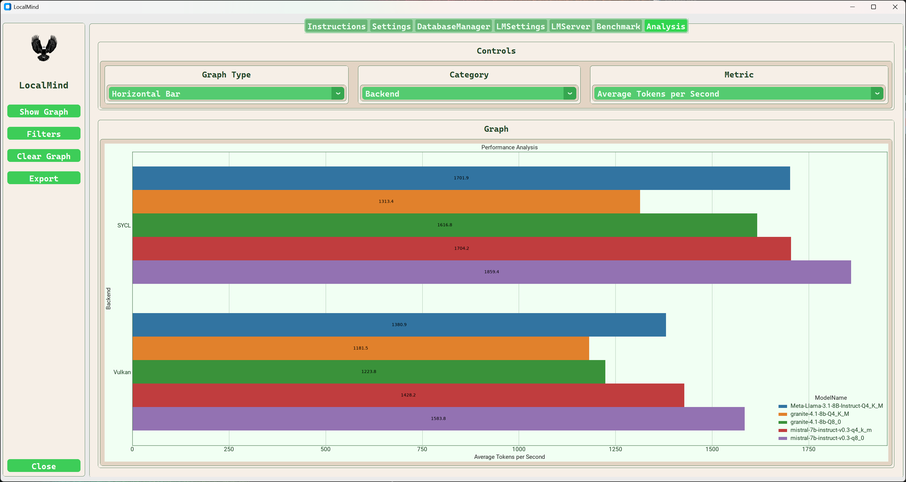

# LocalMind 

## Overview

***

*LocalMind* is a Python application used to deploy LLM models on local hardware. *LocalMind* provides a GUI front end for llama.cpp to run, benchmark, and compare model performance and characteristics.

***

**LocalMind Features**

* Integrated Markdown viewer for displaying documentation.
* Appearance settings include customtkinter theme, dark mode, and font selection.
* Benchmark results are captured in a SQLite or MS SQL Server database.
* Common llama-server settings are persistent and configurable in the LMSettings tab.
* Any of all llama-server command line options may be configured prior to launching.
* Any of all llama-bench command line options may be configured prior to benchmarking.
* The data stored in the benchmark database can be graphically compared in a graph on the analysis tab.

## Tab Details

| Tab Name | Description | Details | 
| :---------- | :-------------- | :---------- |
| Instructions | Documentation Viewer | [Instructions](./instructions.md) |
| Settings | User interface configuration | [Settings](./settings.md) |
| DatabaseManager | Create, databases and tables  Add/Remove tables and columns | [DatabaseManager](./DatabaseManager.md) |
| LMSettings | Configure common llama-server settings | [LMSettings](./LMSettings.md) |
| LMServer | Run the selected model with the selected llama-server backend | [LMServer](./LMServer.md) |
| Bencmark | Benchmark models using wih the selected llama-bench backend | [Benchmark](./Benchmark.md) |
| Analysis | Graphically compare performance and characteristics of benchmark data captured in the benchmark database | [Analysis](./Analysis.md) |

***

## LocalMind Initializaton

* [Installation](./installation.md)
* [Initializaton](./initialization.md)
* [Build and Install llama.cpp](./llama.cpp.md)

