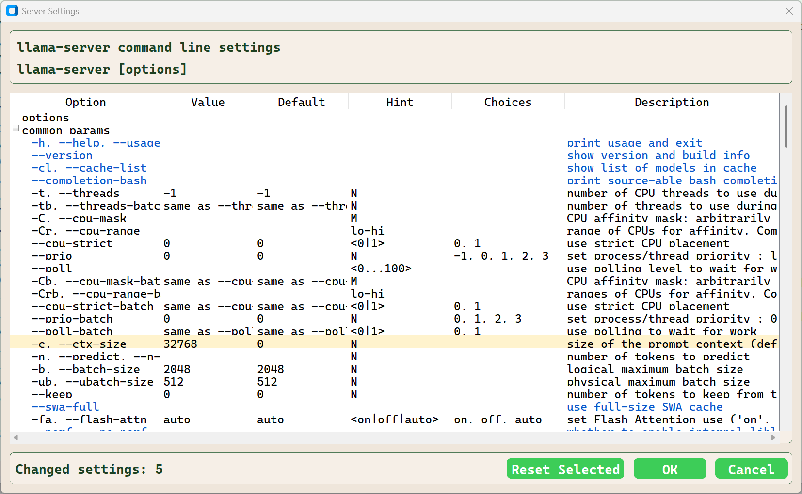
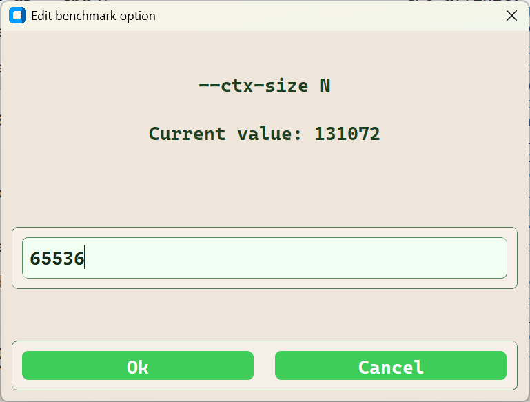
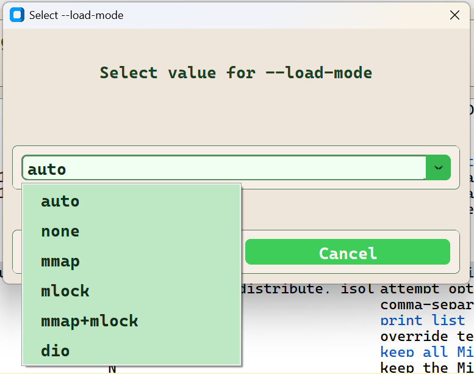

# Server and Benchmark Settings Dialog

The server settings dialog is used to manage the command line options passed to llama-server and llama-bench in the LMServer and Benchmark tabs. 

The source file is widgets/LlamaBenchSettingsDialog.py.

Each instance, server or benchmark, uses the same dialog configured with a different HELP_SPEC. 

The source files for these two HELP_SPEC configurations:

* utils/llama_server_help_spec.py
* utils/llama_bench_help_spec.py

## The command line option configuration Dialog

As the values are changed from the default settings the updated option/value pair are appended to a list of changed options. These are the options that are used to populate the command line for the server or the benchmark.

- When the expected value is a scaler or a discrete string a Value dialog is invoked.
- When the expected value is a choice a Choice dialog is invoked.

## Value Dialog Example

## Choice Dialog Example

