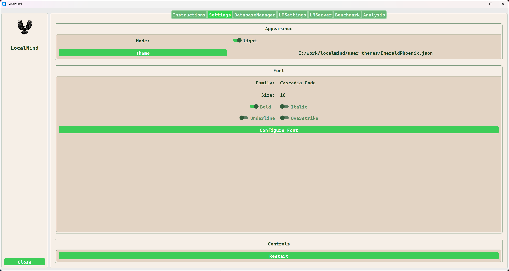
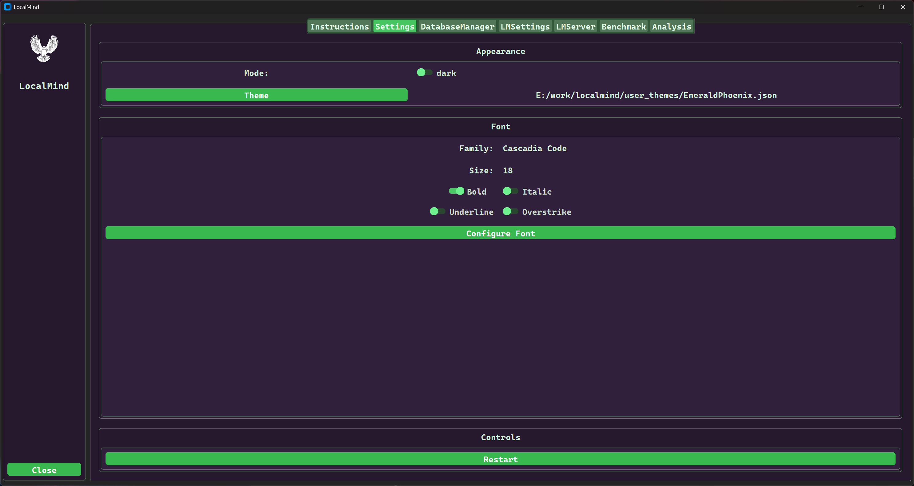
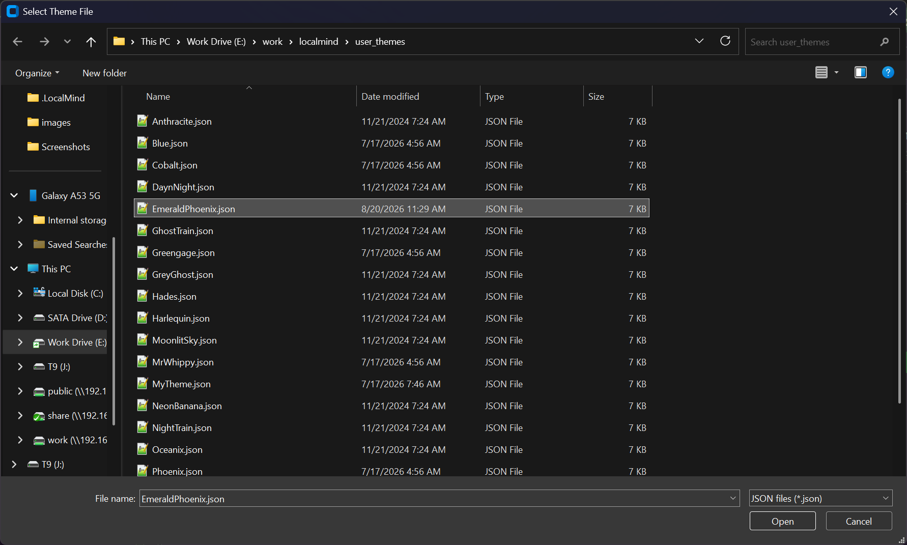
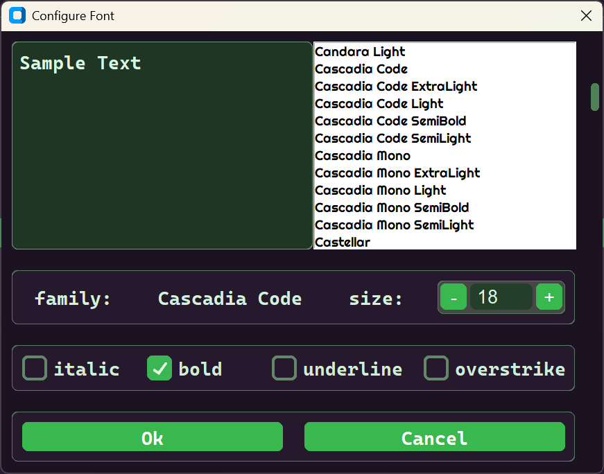

# Settings Tab

Use the Settings Tab to manage persistent appearance settings for LocalMind.

## Visual Previews (EmeraldPhoenix Theme)

## Configuration Summary

| Item | Value | Description |
| :--- | :----- |:----------- |
| Mode | Light/Dark | Instantaneous toggle between light and dark modes. |
| Theme | JSON File | Load themes from LocalMind\user_themes. Opens a file dialog on click. |
| Font | Attributes | Adjust Family, Size, Bold, Italic, Underline, and Overstrike. Click the 'Configure Font' button to change the font settings.|
| Restart | Button | Required to apply new theme configurations. |

## Dialog Screenshots

**Theme Selection:**

**Font Configuration:**

