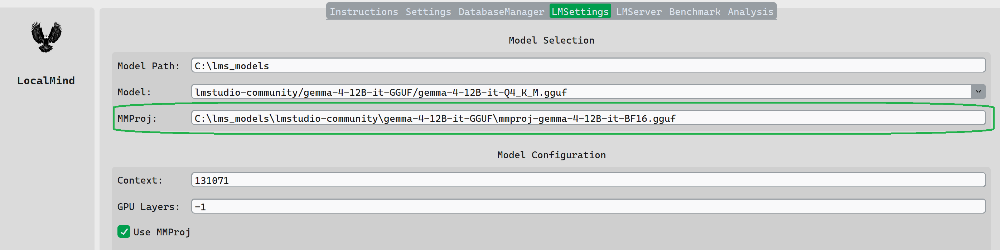
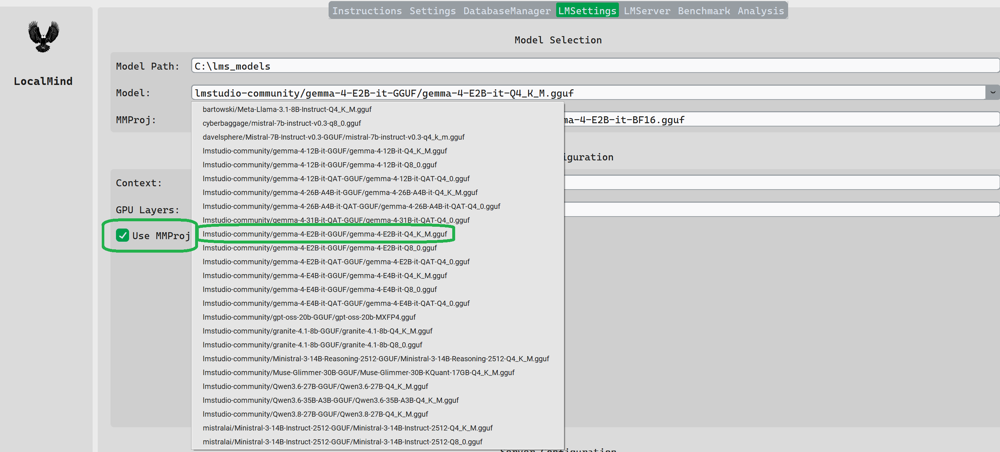

# Using Vision with LocalMind

## Table of Contents

[Introducing the MMPROJ file](#the-mmproj-file)

[The Required Directory Structure](#required-directory-structure)


## The mmproj file

In llama.cpp, an mmproj file is the extra multimodal component that lets a language model understand non-text inputs such as images. The main .gguf contains the language model; the mmproj .gguf contains the machinery that converts an image into embeddings the LLM can consume. In current llama.cpp, this multimodal path is handled primarily through libmtmd.

           image.jpg
               │
               ▼
      ┌─────────────────┐
      │ Vision encoder  │
      │ + projector     │
      │   mmproj.gguf   │
      └────────┬────────┘
               │
        image embeddings
               │
               ▼
prompt ───────► LLM GGUF ───────► text response

The word projector is slightly misleading now. Originally it was mostly the layer that projected vision features into the LLM's embedding space. Modern mmproj files can contain substantially more: the vision encoder, preprocessing-related model components, mergers, and projection layers. That is why the llama.cpp documentation now describes it more generically as the multimodal component.

## Required Directory Structure

When using vision with llama-server via LocalMind it is important that the primary model files and the mproj files are stored together and there should be only one model in the directory containing the model and the mmproj file. This is not to say that you cannot have different quantitization files in the same directory, this is fine.


This requirement is due to how LocalMind associates a mmproj file with a specific model.

This directory tree demonstrates the required directory structure.

The mmproj file associated with the model must begin with or end with 'mmproj'.

```
models
├── gemma-4-12B-it
│		 ├── **gemma-4-12B-it-Q4_K_M.gguf**
│		 └── *mmproj-gemma-4-12B-it-BF16.gguf*
├── gemma-4-E2B-it
│		├── **gemma-4-E2B-it-Q4_K_M.gguf**
│		├── **gemma-4-E2B-it-Q8_0.gguf**
│		└── *mmproj-gemma-4-E2B-it-BF16.gguf*
├── gemma-4-E2B-it-QAT
│		├── **gemma-4-E2B-it-QAT-Q4_0.gguf**
│		└── *mmproj-gemma-4-E2B-it-QAT-BF16.gguf*
├── gemma-4-E4B-it
│		├── **gemma-4-E4B-it-Q4_K_M.gguf**
│		├── **gemma-4-E4B-it-Q8_0.gguf**
│		└── *mmproj-gemma-4-E4B-it-BF16.gguf*
├── gemma-4-E4B-it-QAT
│		├── **gemma-4-E4B-it-QAT-Q4_0.gguf**
│		└── *mmproj-gemma-4-E4B-it-QAT-BF16.gguf*
├── granite-4.1-3b
│		├── granite-4.1-3b-Q4_K_M.gguf
│		└── granite-4.1-3b-Q8_0.gguf
├── granite-4.1-8b
│		└── granite-4.1-8b-Q4_K_M.gguf
├── Meta-Llama-3.1-8B-Instruct
│		└── Meta-Llama-3.1-8B-Instruct-Q4_K_M.gguf
├── mistral-7b-instruct-v0.3
│		└── mistral-7b-instruct-v0.3-q4_k_m.gguf
└── Qwen3.5-4B
    └── Qwen3.5-4B-Q4_K_M.gguf
	
```
	
## Configuring LocalMind to use Vision

In the LM Settings tab there is a read only entry labeled MMProj. This entry is automatically populated when you select a model that resides in a folder that includes the mmproj file.

**It is important to have the correct mmproj file in the folder with the main .gguf model file and there is only one mmproj file in the folder.**



The MMProj entry is automatically selected. You must check the 'Use MMProj' check box to pass the selected mmproj file to llama.cpp when starting the server.


